# Advanced Docking System for Qt

[](https://travis-ci.org/githubuser0xFFFF/Qt-Advanced-Docking-System)
[](https://ci.appveyor.com/project/githubuser0xFFFF/qt-advanced-docking-system/branch/master)
[](gnu-lgpl-v2.1.md)

[What's new](https://github.com/githubuser0xFFFF/Qt-Advanced-Docking-System/releases/latest) •
[Documentation](doc/user-guide.md)

Qt Advanced Docking System lets you create customizable layouts using a full 
featured window docking system similar to what is found in many popular 
integrated development environments (IDEs) such as Visual Studio. 

[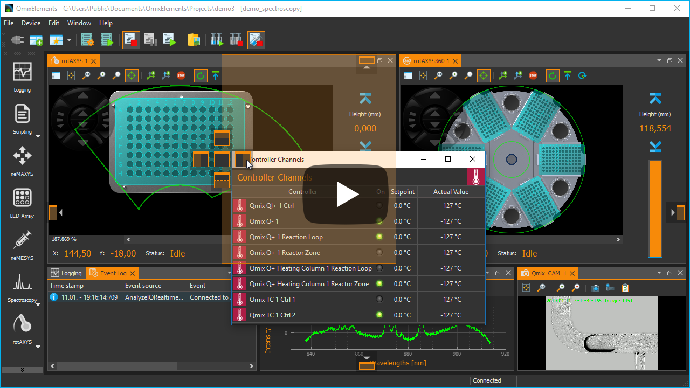](https://www.youtube.com/watch?v=7pdNfafg3Qc)

Everything is implemented with standard Qt functionality without any
platform specific code. Basic usage of QWidgets and QLayouts and using basic 
styles as much as possible.

This work is based on and inspired by the 
[Advanced Docking System for Qt](https://github.com/mfreiholz/Qt-Advanced-Docking-System) 
from Manuel Freiholz. I did an almost complete rewrite of his code to improve
code quality, readibility and to fix all issues from the issue tracker 
of his docking system project.

## Features

### Overview

- [Features](#features)
  - [Overview](#overview)
  - [Docking everywhere - no central widget](#docking-everywhere---no-central-widget)
  - [Docking inside floating windows](#docking-inside-floating-windows)
  - [Grouped dragging](#grouped-dragging)
  - [Perspectives for fast switching of the complete main window layout](#perspectives-for-fast-switching-of-the-complete-main-window-layout)
  - [Opaque and non-opaque splitter resizing](#opaque-and-non-opaque-splitter-resizing)
  - [Opaque and non-opaque undocking](#opaque-and-non-opaque-undocking)
  - [Tab-menu for easy handling of many tabbed dock widgets](#tab-menu-for-easy-handling-of-many-tabbed-dock-widgets)
  - [Many different ways to detach dock widgets](#many-different-ways-to-detach-dock-widgets)
  - [Supports deletion of dynamically created dock widgets](#supports-deletion-of-dynamically-created-dock-widgets)
- [Tested Compatible Environments](#tested-compatible-environments)
  - [Windows](#windows)
  - [macOS](#macos)
  - [Linux](#linux)
- [Build](#build)
- [Getting started / Example](#getting-started--example)
- [Developers](#developers)
- [License information](#license-information)
- [Alternative Docking System Implementations](#alternative-docking-system-implementations)
  - [KDDockWidgets](#kddockwidgets)
  - [QtitanDocking](#qtitandocking)
- [Donation](#donation)
- [Showcase](#showcase)
  - [Qt Creator IDE](#qt-creator-ide)
  - [Qt Design Studio](#qt-design-studio)
  - [QmixElements](#qmixelements)

### Docking everywhere - no central widget

There is no central widget like in the Qt docking system. You can dock on every
border of the main window or you can dock into each dock area - so you are
free to dock almost everywhere.

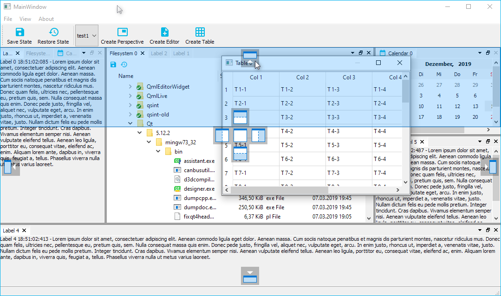\
\
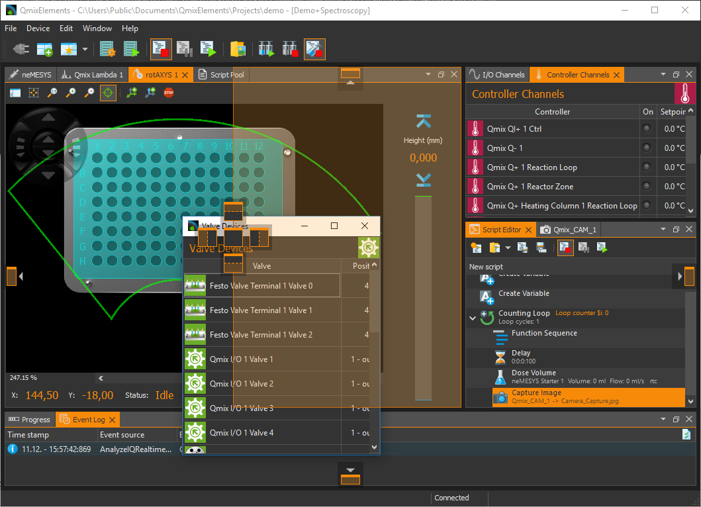

### Docking inside floating windows

There is no difference between the main window and a floating window. Docking
into floating windows is supported.

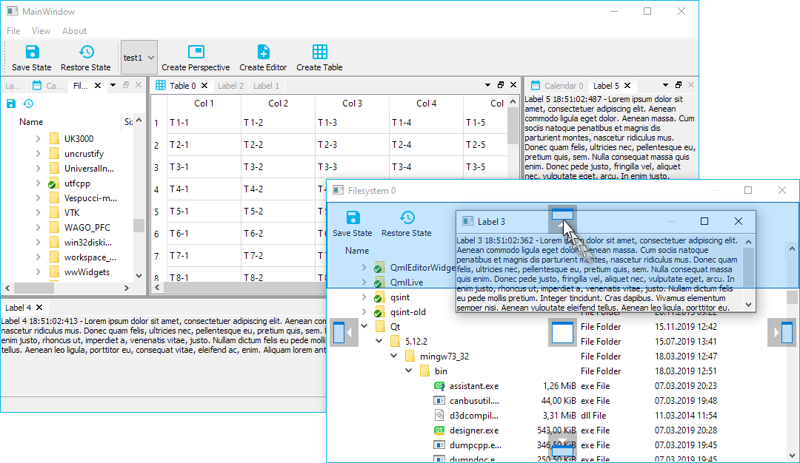\
\
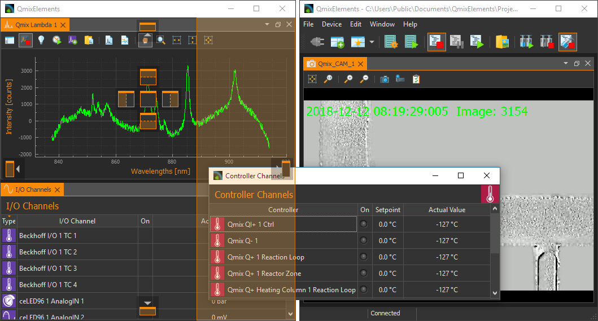

### Grouped dragging

When dragging the titlebar of a dock, all the tabs that are tabbed with it are 
going to be dragged. So you can move complete groups of tabbed widgets into
a floating widget or from one dock area to another one.

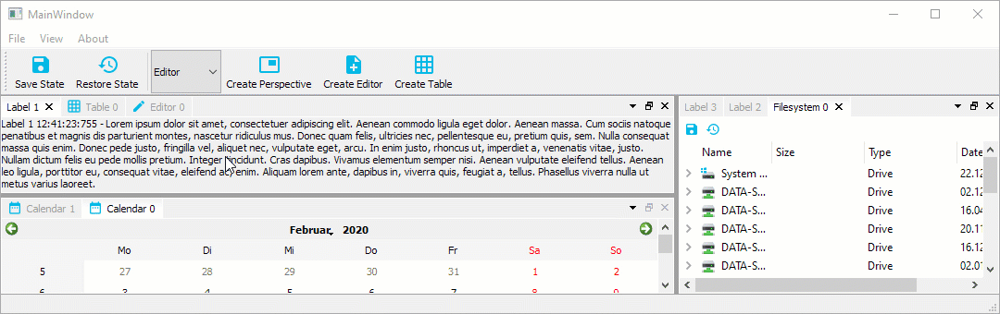\
\
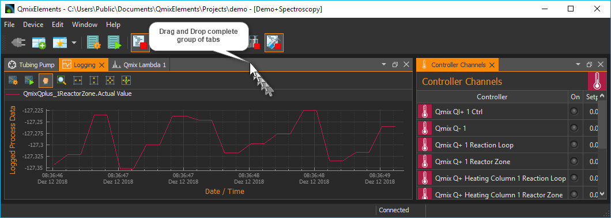

### Perspectives for fast switching of the complete main window layout

A perspective defines the set and layout of dock windows in the main
window. You can save the current layout of the dockmanager into a named
perspective to make your own custom perspective. Later you can simply
select a perspective from the perspective list to quickly switch the complete 
main window layout.

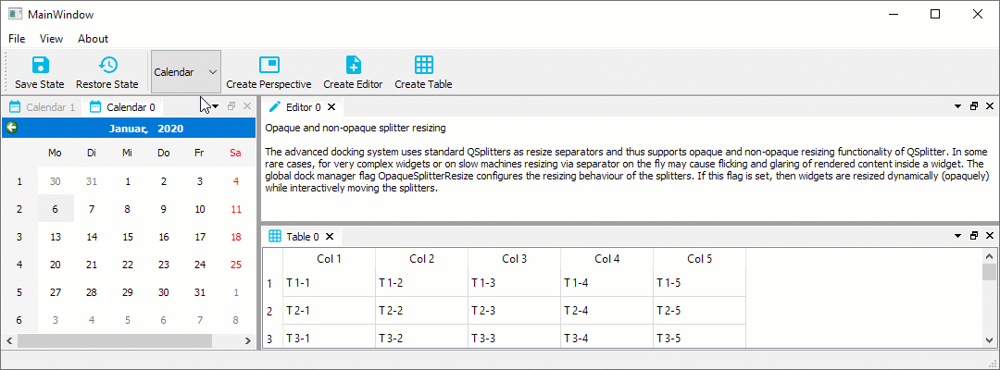\
\
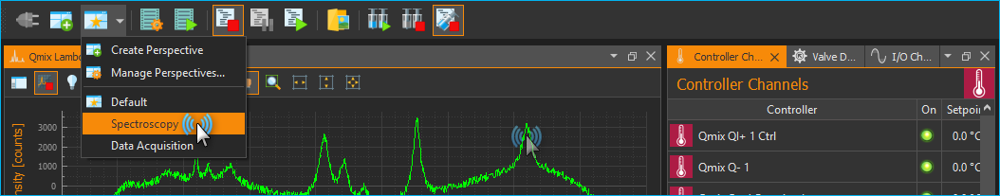

### Opaque and non-opaque splitter resizing

The advanced docking system uses standard QSplitters as resize separators and thus supports opaque and non-opaque resizing functionality of QSplitter. In some rare cases, for very complex widgets or on slow machines resizing via separator on the fly may cause flicking and glaring of rendered content inside a widget. The global dock manager flag `OpaqueSplitterResize` configures the resizing behaviour of the splitters. If this flag is set, then widgets are resized dynamically (opaquely) while interactively moving the splitters. 


If this flag is cleared, the widget resizing is deferred until the mouse button is released - this is some kind of lazy resizing separator.


### Opaque and non-opaque undocking

By default, opaque undocking is active. That means, as soon as you drag a dock widget or a dock area with a number of dock widgets it will be undocked and moved into a floating widget and then the floating widget will be dragged around. That means undocking will take place immediatelly. You can compare this with opaque splitter resizing. If the flag `OpaqueUndocking` is cleared, then non-opaque undocking is active. In this mode, undocking is more like a standard drag and drop operation. That means, the dragged dock widget or dock area is not undocked immediatelly. Instead, a drag preview widget is created and dragged around to indicate the future position of the dock widget or dock area. The actual dock operation is only executed when the mouse button is released. That makes it possible, to cancel an active drag operation with the escape key.

The drag preview widget can be configured by a number of global dock manager flags:
- `DragPreviewIsDynamic`: if this flag is enabled, the preview will be adjusted dynamically to the drop area
- `DragPreviewShowsContentPixmap`: the created drag preview window shows a static copy of the content of the dock widget / dock are that is dragged
- `DragPreviewHasWindowFrame`: this flag configures if the drag preview is frameless like a QRubberBand or looks like a real window

The best way to test non-opaque undocking is to set the standard flags: `CDockManager::setConfigFlags(CDockManager::DefaultNonOpaqueConfig)`.

### Tab-menu for easy handling of many tabbed dock widgets

Tabs are a good way to quickly switch between dockwidgets in a dockarea. However, if the number of dockwidgets in a dockarea is too large, this may affect the usability of the tab bar. To keep track in this situation, you can use the tab menu. The menu allows you to quickly select the dockwidget you want to activate from a drop down menu.

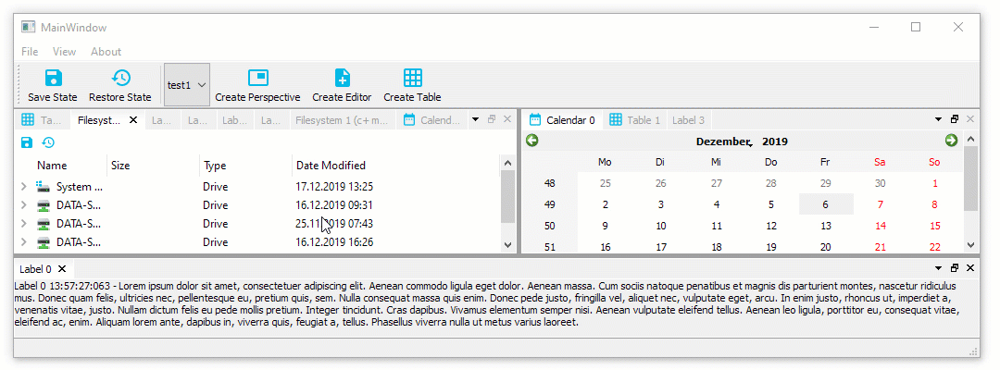

### Many different ways to detach dock widgets

You can detach dock widgets and also dock areas in the following ways:

- by dragging the dock widget tab or the dock area title bar
- by double clicking the tab or title bar
- by using the detach menu entry from the tab and title bar drop down menu

### Supports deletion of dynamically created dock widgets

Normally clicking the close button of a dock widget will just hide the widget and the user can show it again using the toggleView() action of the dock widget. This is meant for user interfaces with a static amount of widgets. But the advanced docking system also supports dynamic dock widgets that will get deleted on close. If you set the dock widget flag `DockWidgetDeleteOnClose` for a certain dock widget, then it will be deleted as soon as you close this dock widget. This enables the implementation of user interfaces with dynamically created editors, like in word processing applications or source code development tools.

## Tested Compatible Environments

### Windows

Windows 10 [](https://ci.appveyor.com/project/githubuser0xFFFF/qt-advanced-docking-system/branch/master)

The library was developed on and for Windows. It is used in a commercial Windows application and is therefore constantly tested.

### macOS

macOS [](https://travis-ci.org/githubuser0xFFFF/Qt-Advanced-Docking-System)

The application can be compiled for macOS. A user reported, that the library works on macOS. If have not tested it.

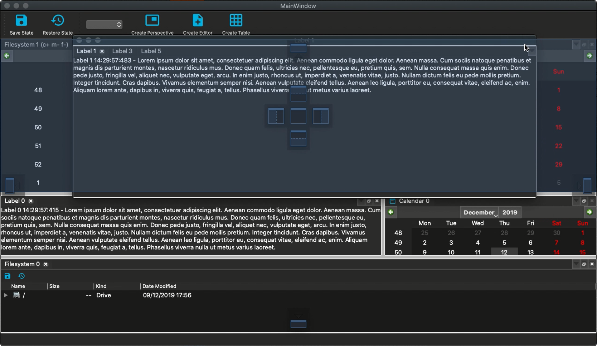

### Linux

Ubuntu [](https://travis-ci.org/githubuser0xFFFF/Qt-Advanced-Docking-System)
[](https://github.com/githubuser0xFFFF/Qt-Advanced-Docking-System/actions?query=workflow%3Alinux-builds)

The application can be compiled for Linux and has been developed and tested with **Kubuntu 18.04** and **Kubuntu 19.10**.

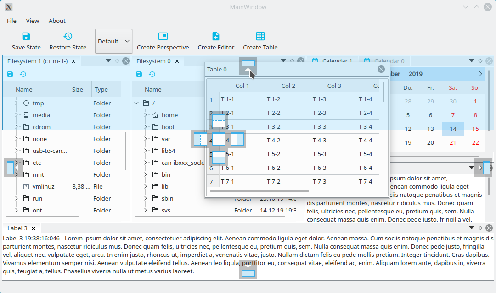

and with **Ubuntu 19.10**

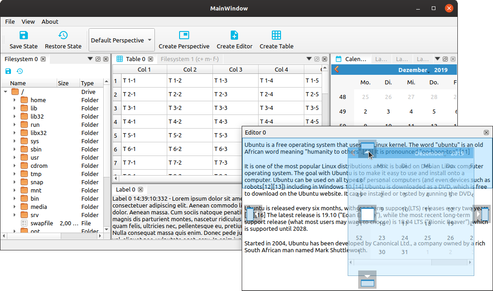

## Build

Open the `ads.pro` with QtCreator and start the build, that's it.
You can run the demo project and test it yourself.

## Getting started / Example

The following example shows the minimum code required to use the advanced Qt docking system.

*MainWindow.h*

```cpp
#include <QMainWindow>
#include "DockManager.h"

namespace Ui {
class MainWindow;
}

class MainWindow : public QMainWindow
{
    Q_OBJECT

public:
    explicit MainWindow(QWidget *parent = 0);
    ~MainWindow();

private:
    Ui::MainWindow *ui;
    
    // The main container for docking
    ads::CDockManager* m_DockManager;
};
```

*MainWindow.cpp*

```cpp
#include "MainWindow.h"
#include "ui_MainWindow.h"

#include <QLabel>

MainWindow::MainWindow(QWidget *parent) :
    QMainWindow(parent),
    ui(new Ui::MainWindow)
{
    ui->setupUi(this);

    // Create the dock manager. Because the parent parameter is a QMainWindow
    // the dock manager registers itself as the central widget.
    m_DockManager = new ads::CDockManager(this);

    // Create example content label - this can be any application specific
    // widget
    QLabel* l = new QLabel();
    l->setWordWrap(true);
    l->setAlignment(Qt::AlignTop | Qt::AlignLeft);
    l->setText("Lorem ipsum dolor sit amet, consectetuer adipiscing elit. ");

    // Create a dock widget with the title Label 1 and set the created label
    // as the dock widget content
    ads::CDockWidget* DockWidget = new ads::CDockWidget("Label 1");
    DockWidget->setWidget(l);

    // Add the toggleViewAction of the dock widget to the menu to give
    // the user the possibility to show the dock widget if it has been closed
    ui->menuView->addAction(DockWidget->toggleViewAction());

    // Add the dock widget to the top dock widget area
    m_DockManager->addDockWidget(ads::TopDockWidgetArea, DockWidget);
}

MainWindow::~MainWindow()
{
    delete ui;
}
```

## Developers

- Uwe Kindler, Project Maintainer
- Manuel Freiholz 

## License information

[](gnu-lgpl-v2.1.md)
This project uses the [LGPLv2.1 license](gnu-lgpl-v2.1.md)


## Alternative Docking System Implementations

If this Qt Advanced Docking System does not fit to your needs you may consider some of the alternative docking system solutions for Qt.

### KDDockWidgets

This is an advanced docking framework for Qt from [KDAB](https://www.kdab.com/). The interesting thing is, that they separated GUI code from logic, so they can easily provide a QtQuick backend in the future.

- [Blog post about KDDockWidgets](https://www.kdab.com/kddockwidgets/)
- [GitHub project](https://github.com/KDAB/KDDockWidgets)


### QtitanDocking

This is a commercial component from [Developer Machines](https://www.devmachines.com/) for Qt Framework that allows to create a Microsoft like dockable user interface. They also offer a lot of other interesting and useful components for Qt.

- [Product page](https://www.devmachines.com/qtitandocking-overview.html)

## Donation

If this project help you reduce time to develop or if you just like it, you can give me a cup of coffee :coffee::wink:.

<a href="https://www.paypal.com/cgi-bin/webscr?cmd=_s-xclick&hosted_button_id=85R64TMMSY9T6">
  
</a>

## Showcase

### [Qt Creator IDE](https://www.qt.io/development-tools)

From version 4.12 on, Qt Creator uses the Advanced Docking Framework for its
Qt Quick Designer. This improves the usability when using multiple screens.


### [Qt Design Studio](https://www.qt.io/ui-design-tools)

Taken from the [Qt Blog](https://www.qt.io/blog/qt-design-studio-1.5-beta-released):

> The most obvious change in [Qt Design Studio 1.5](https://www.qt.io/blog/qt-design-studio-1.5-beta-released) is the integration of dock widgets using the Qt Advanced Docking System. This allows the user to fully customize the workspace and also to undock any view into its own top level window. This especially improves the usability when using multiple screens.

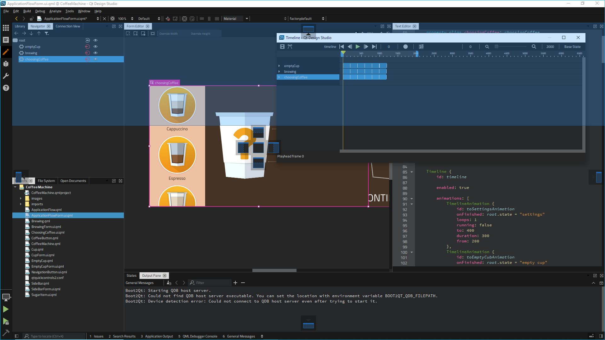

### [QmixElements](https://www.cetoni.com/products/qmixelements/)

The QmixElements software from [CETONI](https://www.cetoni.com) is a comprehensive, 
plugin-based and modular laboratory automation software for controlling CETONI devices using a joint graphical user interface. The software features a powerful script system to automate processes. This [blog post](https://www.cetoni.com/blog/qmixelements-advanced-docking-system/) gives a nice overview about the use of the Qt
Advanced Docking System in the QmixElements sofware.


