# User Guide

- [Configuration Flags](#configuration-flags)
  - [Setting Configuration Flags](#setting-configuration-flags)
  - [`ActiveTabHasCloseButton`](#activetabhasclosebutton)
  - [`DockAreaHasCloseButton`](#dockareahasclosebutton)
  - [`DockAreaCloseButtonClosesTab`](#dockareaclosebuttonclosestab)
  - [`OpaqueSplitterResize`](#opaquesplitterresize)
  - [`XmlAutoFormattingEnabled`](#xmlautoformattingenabled)
  - [`XmlCompressionEnabled`](#xmlcompressionenabled)
  - [`TabCloseButtonIsToolButton`](#tabclosebuttonistoolbutton)
  - [`AllTabsHaveCloseButton`](#alltabshaveclosebutton)
  - [`RetainTabSizeWhenCloseButtonHidden`](#retaintabsizewhenclosebuttonhidden)
  - [`OpaqueUndocking`](#opaqueundocking)
  - [`DragPreviewIsDynamic`](#dragpreviewisdynamic)
  - [`DragPreviewShowsContentPixmap`](#dragpreviewshowscontentpixmap)
  - [`DragPreviewHasWindowFrame`](#dragpreviewhaswindowframe)
  - [`AlwaysShowTabs`](#alwaysshowtabs)
  - [`DockAreaHasUndockButton`](#dockareahasundockbutton)
  - [`DockAreaHasTabsMenuButton`](#dockareahastabsmenubutton)
  - [`DockAreaHideDisabledButtons`](#dockareahidedisabledbuttons)
  - [`DockAreaDynamicTabsMenuButtonVisibility`](#dockareadynamictabsmenubuttonvisibility)
  - [`FloatingContainerHasWidgetTitle`](#floatingcontainerhaswidgettitle)
  - [`FloatingContainerHasWidgetIcon`](#floatingcontainerhaswidgeticon)
  - [`HideSingleCentralWidgetTitleBar`](#hidesinglecentralwidgettitlebar)
  - [`FocusHighlighting`](#focushighlighting)
  - [`EqualSplitOnInsertion`](#equalsplitoninsertion)
  - [`FloatingContainerForceNativeTitleBar` (Linux only)](#floatingcontainerforcenativetitlebar-linux-only)
  - [`FloatingContainerForceQWidgetTitleBar` (Linux only)](#floatingcontainerforceqwidgettitlebar-linux-only)
- [Central Widget](#central-widget)
- [Styling](#styling)
  - [Disabling the Internal Style Sheet](#disabling-the-internal-style-sheet)

## Configuration Flags

The Advanced Docking System has a number of global configuration options to
configure the design and the functionality of the docking system. Eachs
configuration will be explained in detail in the following sections.

### Setting Configuration Flags

You should set the configuration flags before you create the dock manager
instance. That means, setting the configurations flags is the first thing
you do, if you use the library.

```c++
CDockManager::setConfigFlags(CDockManager::DefaultOpaqueConfig);
CDockManager::setConfigFlag(CDockManager::RetainTabSizeWhenCloseButtonHidden, true);
...
d->DockManager = new CDockManager(this);
```

If you set the configurations flags, you can set individual flags using the
function `CDockManager::setConfigFlag` or you can set all flags using
the function `CDockManager::setConfigFlags`. Instead of settings all
flags individualy, it is better to pick a predefined set of configuration
flags and then modify individual flags. The following predefined
configurations are avilable

- `DefaultNonOpaqueConfig` - uses non opaque splitter resizing and non opaque docking
- `DefaultOpaqueConfig` - uses opaque splitter resizing and opaque docking

Pick one of those predefined configurations and then modify the following
configurations flags to adjust the docking system to your needs.

### `ActiveTabHasCloseButton`

If this flag is set (default configuration), the active tab in a tab area has
a close button.

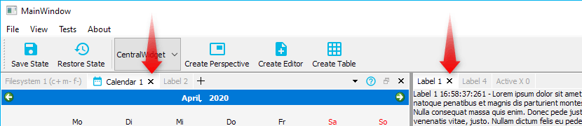

If this flag is cleared, the active tab has no close button. You can combine
this with the flag `DockAreaCloseButtonClosesTab` to use the close button
of the dock are to close the single tabs.

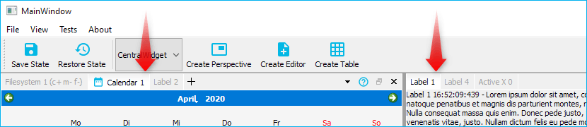

### `DockAreaHasCloseButton`

If the flag is set (default configuration) each dock area has a close button.

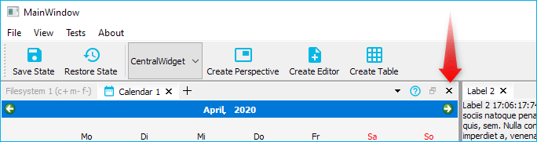

If this flag is cleared, dock areas do not have a close button.

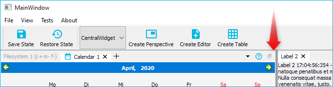

### `DockAreaCloseButtonClosesTab`

If the flag is set, the dock area close button closes the active tab,
if not set, it closes the complete dock area (default).

### `OpaqueSplitterResize`

The advanced docking system uses standard `QSplitters` as resize separators and thus supports opaque and non-opaque resizing functionality of `QSplitter`. In some rare cases, for very complex widgets or on slow machines resizing via separator on the fly may cause flicking and glaring of rendered content inside a widget. This global dock manager flag configures the resizing behaviour of the splitters. If this flag is set, then widgets are resized dynamically (opaquely) while interactively moving the splitters. If you select the predefined configuration `DefaultOpaqueConfig`, then this is the configured behaviour.

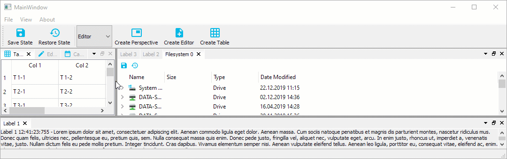

If this flag is cleared, the widget resizing is deferred until the mouse button is released - this is some kind of lazy resizing separator. If you select the predefined
configuration `DefaultNonOpaqueConfig`, then this is the configured behaviour.

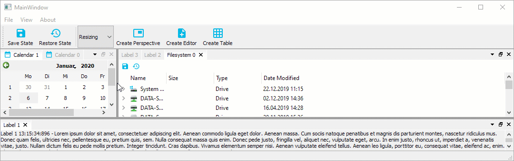

### `XmlAutoFormattingEnabled`

If enabled, the XML writer automatically adds line-breaks and indentation to
empty sections between elements (ignorable whitespace). This is used, when
the current state or perspective is saved. It is disabled by default.

### `XmlCompressionEnabled`

If enabled, the XML output will be compressed and is not human readable anymore.
This ie enabled by default to minimize the size of the saved data.

### `TabCloseButtonIsToolButton`

If enabled the tab close buttons will be `QToolButtons` instead of `QPushButtons` - 
disabled by default. Normally the default configuration should be ok but if your
application requires `QToolButtons` instead of `QPushButtons` for styling reasons
or for any other reasons, then you can enable this flag.

### `AllTabsHaveCloseButton`

If this flag is set, then all tabs that are closable show a close button. The
advantage of this setting is that the size of the tabs does not change and the
user can immediately close each tab. The disadvantage is that all tabs take up
more space.

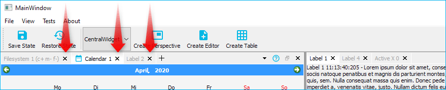

If this flas is cleared, then only the active tab has a close button (default)
and therefore the tabs need less space.


### `RetainTabSizeWhenCloseButtonHidden`

If this flag is set, the space for the close button is reserved even if the
close button is not visible. This flag is disabled by default. If this flag
is disabled, the tab size dynamically changes if the close button is
visible / hidden in a tab. If this flag is enabled, the tab size always remains
constant, that means, if enabled, the tabs need more space.

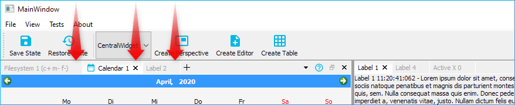

### `OpaqueUndocking`

If this flag is set, opaque undocking is active. That means, as soon as you drag a dock widget or a dock area with a number of dock widgets it will be undocked and moved into a floating widget and then the floating widget will be dragged around. That means undocking will take place immediatelly. You can compare this with opaque splitter resizing.

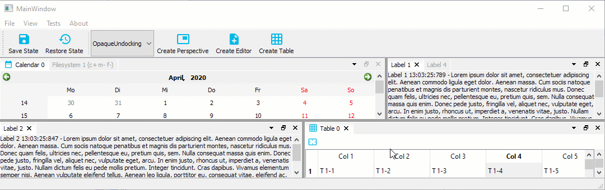

If you would like to test opaque undocking, you should set the pedefined config
flags `CDockManager::DefaultOpaqueConfig`.

```c++
CDockManager::setConfigFlags(CDockManager::DefaultOpaqueConfig);
```

If this flag is cleared (default), then non-opaque undocking is active. In this mode, undocking is more like a standard drag and drop operation. That means, the dragged dock widget or dock area is not undocked immediatelly. Instead, a drag preview widget is created and dragged around to indicate the future position of the dock widget or dock area. The actual dock operation is only executed when the mouse button is released. That makes it possible, to cancel an active drag operation with the escape key.

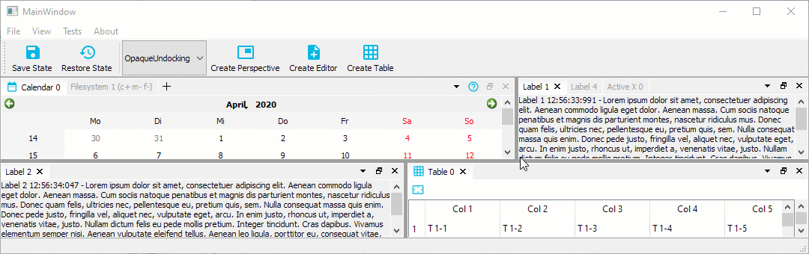

The drag preview widget can be configured by a number of global dock manager flags:

- `DragPreviewIsDynamic`
- `DragPreviewShowsContentPixmap`
- `DragPreviewHasWindowFrame`

Non-opaque undocking is enabled by default. If you would like to enable it
explicitely, you can do this by setting the predefined configuration flags
`CDockManager::DefaultNonOpaqueConfig`.

```c++
CDockManager::setConfigFlags(CDockManager::DefaultNonOpaqueConfig);
```

### `DragPreviewIsDynamic`

If non-opaque undocking is enabled, this flag defines the behavior of the drag 
preview window. If this flag is enabled, then it will give the user the
impression, that the floating drag preview is dynamically adjusted to the drop
area. In order to give the perfect impression, you should disable the flags
`DragPreviewShowsContentPixmap` and `DragPreviewHasWindowFrame`.

```c++
CDockManager::setConfigFlag(CDockManager::DragPreviewIsDynamic, true);
CDockManager::setConfigFlag(CDockManager::DragPreviewShowsContentPixmap, false);
CDockManager::setConfigFlag(CDockManager::DragPreviewHasWindowFrame, false);
```

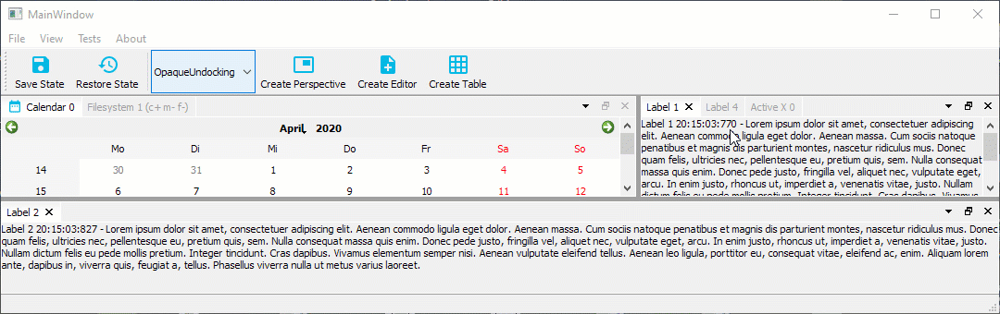

### `DragPreviewShowsContentPixmap`

If non-opaque undocking is enabled, the created drag preview window shows a 
copy of the content of the dock widget / dock are that is dragged, if this
flag is enabled (default).

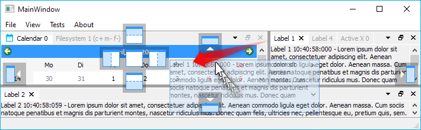

If this flag is disabled, the drag preview is only a transparent `QRubberBand`
like window without any content.

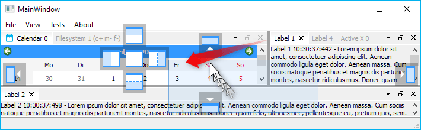

### `DragPreviewHasWindowFrame`

If non-opaque undocking is enabled, then this flag configures if the drag 
preview is frameless (default) or looks like a real window. If it is enabled,
then the drag preview is a transparent window with a system window frame.

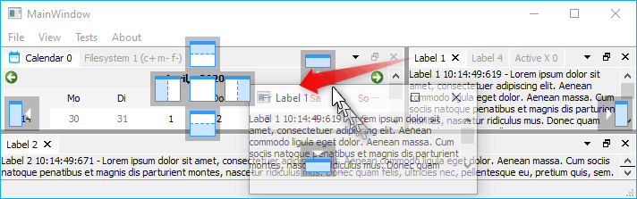

### `AlwaysShowTabs`

If this option is enabled, the tab of a dock widget is always displayed - even
if it is the only visible dock widget in a floating widget. In the image below
on the left side, the flag is disabled (default) and on the right side it is
enabled.

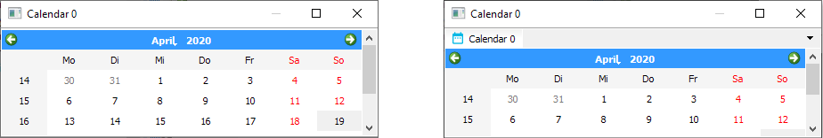

### `DockAreaHasUndockButton`

If the flag is set (default) each dock area has an undock button (right
image). If the flag is cleared, a dock area has no undock button (left image)

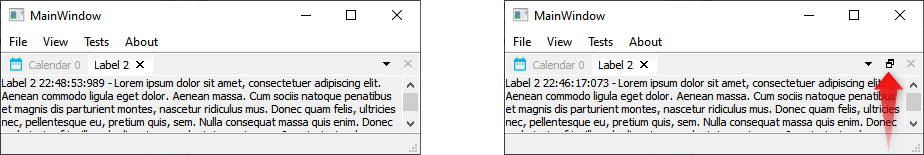

### `DockAreaHasTabsMenuButton`

Tabs are a good way to quickly switch between dockwidgets in a dockarea.
However, if the number of dockwidgets in a dockarea is too large, this may affect
the usability of the tab bar. To keep track in this situation, you can use the
tab menu. The menu allows you to quickly select the dockwidget you want to
activate from a drop down menu. This flag shows / hides the tabs menu button
in the dock area title bar. On the left side, the tabs menu button flag
is cleared.

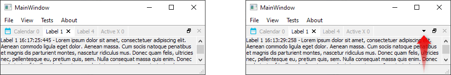

### `DockAreaHideDisabledButtons`

If certain flags of a dock widget are disabled, like `DockWidgetClosable` or
`DockWidgetFloatable`, then the corresponding dock area buttons like close
button or detach button are disabled (greyed out). This is the default
setting.

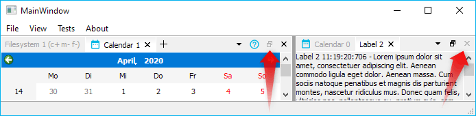

If the flag is set, disabled dock area buttons will not appear on the toolbar at
all - they are hidden.

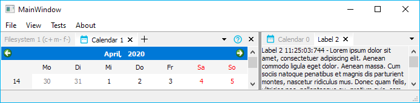

### `DockAreaDynamicTabsMenuButtonVisibility`

If this flag is cleared, the the tabs menu button is always visible. This is
the default setting. If the flag is set, the tabs menu button will be shown
only when it is required - that means, if the tabs are elided.

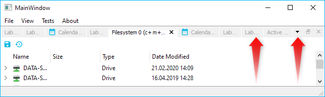

If the tabs are not elided, the tabs menu button is hidden.

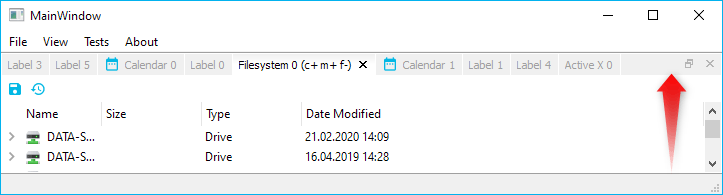

### `FloatingContainerHasWidgetTitle`

If set (default), the floating widget window title reflects the title of the
current dock widget.

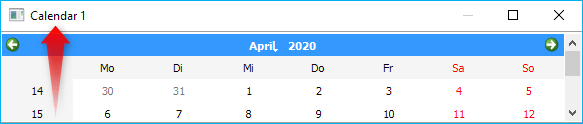

otherwise it displays application name as window title.

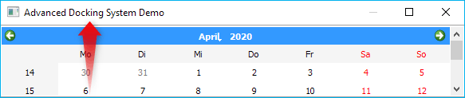

### `FloatingContainerHasWidgetIcon`

If set, the floating widget icon reflects the icon of the current dock widget

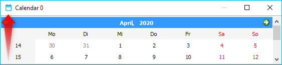

otherwise (default setting) it displays application icon.

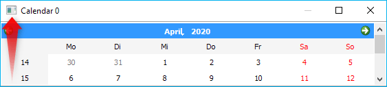

### `HideSingleCentralWidgetTitleBar`

If there is only one single visible dock widget in the main dock container (the dock manager)
and if this flag is set, then the titlebar of this dock widget will be hidden.
This only makes sense for non draggable and non floatable dock widgets and enables
the creation of some kind of "central" static widget. Because the titlebar is
hidden, it is not possible to drag out the central widget to make it floating
or to close it via the close button.

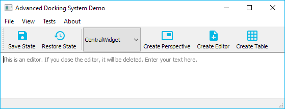

The Advanced Docking System is meant for applications without a static central
widget and normally does not know anything about a central static widget.
Therefore this flag is disabled by default and a central single dock widget
still has a titlebar to drag it out of the main window.

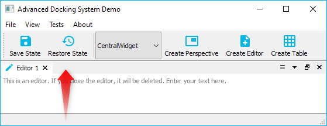

### `FocusHighlighting`

If this is enabled, the docking system is able to highlight the tab and the
components of a dock area with a different style (i.e. a different color).
This option is disabled by default and needs to be enabled explicitely
because it adds some overhead. The dock manager needs to react on focus
changes and dock widget dragging to highlight the right dock widget. You should
enable it only, if you really need it for your application.

If the feature is enabled, you can also connect to the new dock manager
signal `focusedDockWidgetChanged(CDockWidget* old, CDockWidget* now)` to
react on focus changes and to prepare the content of the focused dock
widget.

You can click into the tab, the titlebar or the content of a dock widget
to focus it.

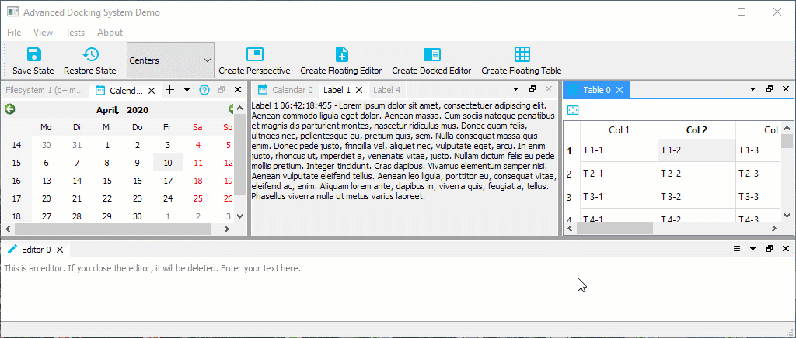

For the focused dock widget and dock widget tab, the property `focused` will
be set to true and you can use this property to style the focused dock
widget differently. The picture above uses the following styling:

```css
/* Color the tab with the nhighlight color */
ads--CDockWidgetTab[focused="true"]
{
    background: palette(highlight);
    border-color: palette(highlight);
}

/* Use a different colored close button icon to match the test color */
ads--CDockWidgetTab[focused="true"] > #tabCloseButton
{
	qproperty-icon: url(:/ads/images/close-button-focused.svg)
}

/* Make a hovered focused close button a little bit lighter */
ads--CDockWidgetTab[focused="true"] > #tabCloseButton:hover
{
	background: rgba(255, 255, 255, 48);
}

/* Make a pressed focused close button even more lighter */
ads--CDockWidgetTab[focused="true"] > #tabCloseButton:pressed
{
	background: rgba(255, 255, 255, 92);
}

/* Use a different color for the tab label */
ads--CDockWidgetTab[focused="true"] QLabel
{
    color: palette(light);
}

/* Paint a nice solid line for the whole title bar to create the illusion
   of an active tab */
ads--CDockAreaWidget[focused="true"] ads--CDockAreaTitleBar
{
	background: transparent;
	border-bottom: 2px solid palette(highlight);
	padding-bottom: 0px;
}
```

If you have a content widget that does not support focussing for some reason
(like `QVTKOpenGLStereoWidget` from the [VTK library](https://github.com/Kitware/VTK)),
then you can manually switch the focus by reacting on mouse events. The 
following code shows, how to install en event filter on the `QVTKOpenGLStereoWidget`
to properly switch the focus on `QEvent::MouseButtonPress`:

```c++
static ads::CDockWidget* createVTK2DWindow(QMenu* ViewMenu, QObject* EventFilter)
{
    QVTKOpenGLStereoWidget* qvtkOpenGLStereoWidget = new QVTKOpenGLStereoWidget;
    ads::CDockWidget* DockWidget = new ads::CDockWidget("2D Window");
    DockWidget->setWidget(qvtkOpenGLStereoWidget);
    qvtkOpenGLStereoWidget->installEventFilter(EventFilter);
    qvtkOpenGLStereoWidget->setProperty("DockWidget", QVariant::fromValue(DockWidget));
    return DockWidget;
}
```

Now we can use the event filter function to react on mouse events and then
use the dock manager function `setDockWidgetFocused()` to switch the focus:

```c++
bool CMainWindow::eventFilter(QObject *watched, QEvent *event)
{
    if (event->type() == QEvent::MouseButtonPress)
    {
        QVTKOpenGLStereoWidget* vtkWidget =  qobject_cast<QVTKOpenGLStereoWidget*>(watched);
        auto vDockWidget = vtkWidget->property("DockWidget");
        ads::CDockWidget* DockWidget = nullptr;
        if (vDockWidget.isValid())
        {
            DockWidget = qvariant_cast<ads::CDockWidget*>(vDockWidget);
        }

        if (DockWidget)
        {
            d->DockManager->setDockWidgetFocused(DockWidget);
        }
    }
    return false;
}
```

### `EqualSplitOnInsertion`

This flag configures how the space is distributed if a new dock widget is
inserted into an existing dock area. The flag is disabled by default. If 3 
dock widgets are inserted with the following code

```c++
d->DockManager->addDockWidget(ads::RightDockWidgetArea, DockWidget, EditorArea);
```

then this is the result, if the flag is disabled:

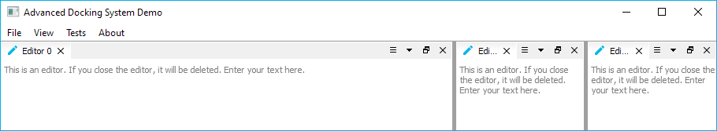

If the flag is enabled, then the space is equally distributed to all widgets 
in a  splitter:

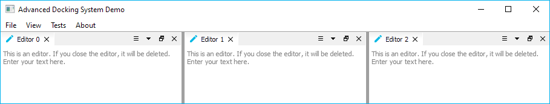


### `FloatingContainerForceNativeTitleBar` (Linux only)

Since release 3.6 the library supports native title bars and window decorations
for floating widgets on Linux (thanks to a user contribution).
Native title bars and window decorations are supported by most Linux window
managers, such as Compiz or Xfwm. Some window managers like KWin do not properly
support this feature. Native floating widgets look better because of the native
styling and the support all window manager features like snapping to window
borders or maximizing. The library tries to detect the window manager during
runtime and activates native window decorations if possible:

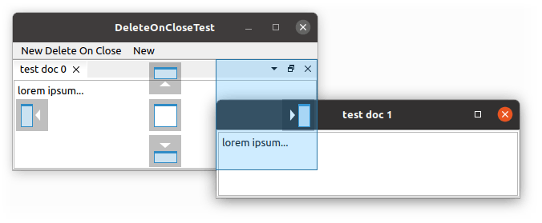

If you would like to overwrite this autodetection, then you can  activate this
flag to force native window titlebars. You can overwrite autodetection and this
flag, if you set the environment variable `ADS_UseNativeTitle` to 0 or 1.

### `FloatingContainerForceQWidgetTitleBar` (Linux only)

If your window manager (i.e. KWin) does not properly support native floating
windows, the docking library falls back to QWidget based floating widget
title bars.

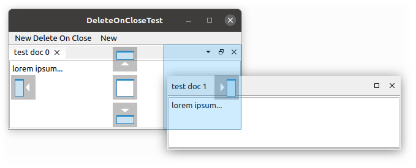

If you would like to overwrite autodetection, then you can activate this flag
to force QWidget based title bars. You can overwrite autodetection and this
flag, if you set the environment variable `ADS_UseNativeTitle` to 0 or 1.

## Central Widget

The Advanced Docking System has been developed to overcome the limitations of
the native Qt docking system with its central widget concept. This was the
reason that until version 3.6 of the library, there was no support for such
thing like a central widget. Thanks to the contribution of a user the library
now supports a central widget.

In the Advanced Docking System a central widget is a docking widget that is
neither closable nor movable or floatable. A central widget has no title bar
and so it is not possible for the user to hide, close or drag the central
widget. If there is a central widget, then also the distribution of the sizes
for the dock widgets around the central widget is different:

- **no central widget (default)** - on resizing the available space is
distributed to all dock widgets - the size of all dock widgets
shrinks or grows
- **with central widget** - on resizing only the central widget is resized - the
dock widgets around the central widget keep their size (see the animation below)

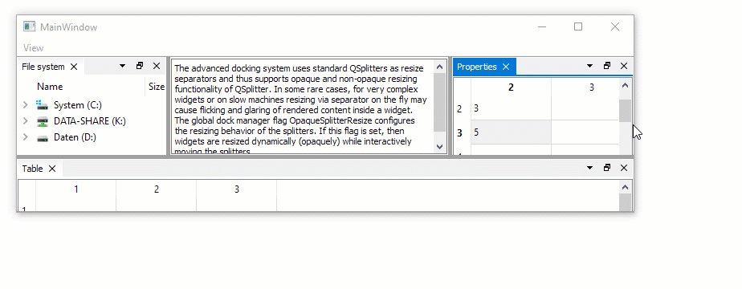

To set a central widget, you just need to pass your central dock widget
to the dock manager `setCentralWidget` function:

```c++
auto* CentralDockArea = DockManager->setCentralWidget(CentralDockWidget);
```

See the `centralwidget` example to learn how it works.

## Styling

The Advanced Docking System supports styling via [Qt Style Sheets](https://doc.qt.io/qt-5/stylesheet.html). All components like splitters, tabs, buttons, titlebar and
icons are styleable this way.

### Disabling the Internal Style Sheet

The dock manager uses an internal stylesheet to style its components. That
means, the style that you see in the demo application comes from the
internal stylesheets that you will find in `src/stylesheets` folder. If you want
to disable this internal stylesheet because your application uses its own,
just call the function for settings the stylesheet with an empty string.

```c++
DockManager->setStyleSheet("");
```
